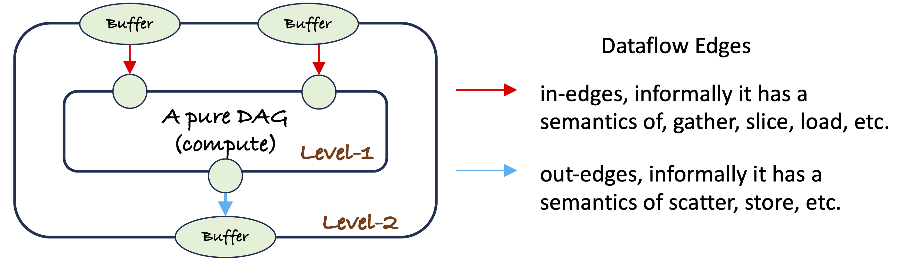

# TiledKernel
## Introduction
TiledKernel is a **code generation library** based on **macro kernels** and **memory hierarchy graph data structure**.

TiledKernel aims to build a graph data structure and a series of macro kernels for code generation. The goal of TiledKernel is to generate high-performance fused kernels by leveraging a data structure that takes into account hardware characteristics and manually optimized macro kernels, while reducing scheduling overhead.

In most of the current state-of-the-art (SOTA) methods, hardware vendor-provided libraries or manually optimized CUDA C methods are commonly used for code generation. However, the implementation of library functions is often black-box and cannot be fused together. The scheduling space of CUDA C implementations is large, and their performance deviates significantly from library functions. Therefore, TiledKernel is dedicated to proposing an approach that balances performance and flexibility.

To achieve these goals, TiledKernel will provide a data structure based on graph memory hierarchy and performance-optimized macro kernels.

### Memory Hierarchy Graph Data Structure
To represent the entire computational process, **a data structure (I think we can just refer to it as the IR)** is required. While the specifics of the data structure can be set aside for now, the overall structure should be hierarchical in nature as shown below.

In this hierarchical dataflow graph, the dataflow edges have explicit operational semantics for data access.

- The in-edges represent read operations, while the out-edges represent write operations.
- There maybe various different implementations for these operations. For example, read operations can be translated into gather, slice, index, and other operations, while write operations can be translated into scatter, store, and so on. 



### Macro Kernels
To balance performance and usability, Macro Kernels are planned to be implemented using **cute**.

Additionally, to support computations at different levels, we also plan to enable the synthesis of multiple macro kernels into a micro_op and reuse macro kernels at higher memory hierarchy levels.

To avoid overly complex considerations, we take the example of Back2Back GEMM at the RF memory level. The dataflow graph can be represented simply as follows:

```
-----------         -----------      ---------------
| Load a'   |   --> | Load b'  |  -> | mma (a', b') |
-----------         -----------       ---------------
```

We will name the above dataflow graph structure as micro_op_a, representing a macro op at the RF level. Simultaneously, we can invoke micro_op_a as a macro op at the Shared Memory level, at the same level as Load/Store/Compute, and compose a higher-level dataflow graph. It is worth noting that when generating macro_ops at different levels, it is necessary to insert synchronization primitives at different levels.
